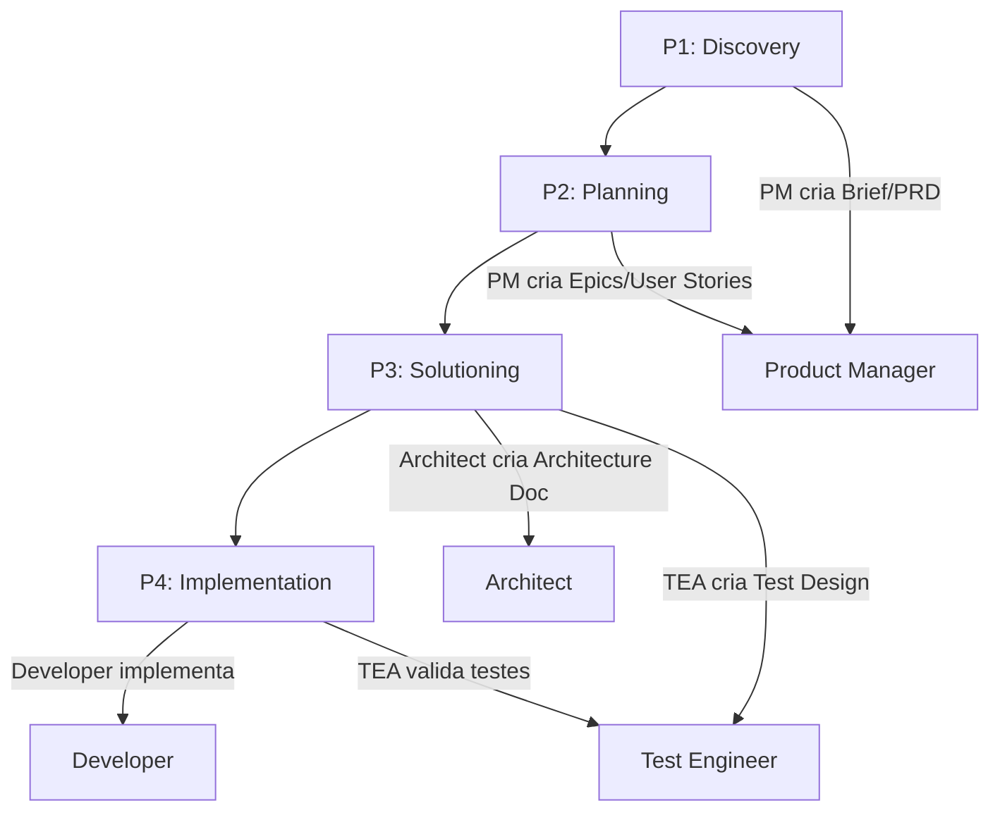

# Setup Projeto Cálculo de Médias - BMad Framework

## Objetivo

Configurar o projeto de cálculo de médias de alunos usando BMad Framework com Java 21, Maven, SQLite, JPA, Jakarta EE e testes automatizados.

## Estrutura do Projeto

### Domínio

- **Cursos**: Múltiplos cursos na faculdade
- **Disciplinas**: Pertencem a cursos, têm professores
- **Alunos**: Matriculados em disciplinas
- **Professores**: Lecionam disciplinas
- **Notas**: Cada disciplina tem 2 notas por aluno
- **Cálculo de Média**: 
  - Média >= 7: Aprovado
  - Média >= 5 e < 7: Exame
  - Média < 5: Reprovado

## Arquivos a Criar/Atualizar

### 1. Configurações BMad

#### `.cursorrules`

- Atualizar stack para Java 21, Maven, JPA, Jakarta EE
- Manter protocolo de fases BMad

#### `_bmad/bmm/agents/architect.yaml`

- Atualizar responsabilidades para JPA ao invés de JDBC puro
- Incluir design de entidades JPA e configuração Jakarta EE

#### `_bmad/bmm/agents/developer.yaml`

- Atualizar para incluir criação de endpoints REST (Jakarta REST)
- Incluir implementação de camadas (Controller, Service, Repository)

#### `_bmad/bmm/agents/pm.yaml`

- Manter foco em requisitos de cálculo de média
- Atualizar para mencionar API REST

#### `_bmad-output/sprint-status.yaml`

- Atualizar nome do projeto se necessário
- Manter fase atual (P1_Discovery)

### 2. Estrutura Maven

#### `pom.xml`

- Java 21
- Maven Compiler Plugin
- Dependências:
  - Jakarta EE (Jakarta REST, Jakarta Persistence)
  - Hibernate/JPA provider
  - SQLite JDBC driver
  - JUnit 5 para testes
  - Jakarta Validation
  - Jakarta CDI (se necessário)

#### Estrutura de Pastas

- `src/main/java` - código fonte
- `src/main/resources` - recursos (persistence.xml, application.properties)
- `src/test/java` - testes
- `src/test/resources` - recursos de teste

### 3. Arquivos de Configuração

#### `src/main/resources/META-INF/persistence.xml`

- Configuração JPA para SQLite
- Propriedades de conexão

#### `src/main/resources/application.properties` (opcional)

- Configurações adicionais se necessário

#### `src/test/resources/META-INF/persistence.xml`

- Configuração JPA para testes (banco em memória ou arquivo temporário)

### 4. Estrutura de Pacotes Inicial

Criar estrutura básica de pacotes:

- `com.faculdade.media` (ou similar)
  - `domain` - entidades JPA
  - `repository` - repositórios JPA
  - `service` - lógica de negócio
  - `controller` - endpoints REST
  - `dto` - objetos de transferência
  - `exception` - exceções customizadas

### 5. Configuração DevContainer

#### `.devcontainer/devcontainer.json`

- Imagem base: `mcr.microsoft.com/devcontainers/java` ou similar com Java 21
- Extensões recomendadas:
  - Extension Pack for Java (Microsoft)
  - Maven for Java
- Configurações:
  - Java 21
  - Maven pré-instalado
  - Variáveis de ambiente se necessário
- Features opcionais:
  - Git
  - Docker-in-Docker (se necessário)

#### `.devcontainer/Dockerfile` (opcional)

- Se necessário customizar a imagem base
- Instalar dependências adicionais

### 6. Documentação

#### `README.md`

- Descrição do projeto
- Tecnologias e versões
- Pré-requisitos
- Como executar (incluindo devcontainer)
- Estrutura do projeto
- Regras de negócio (cálculo de médias)
- Metodologia BMad
- Status do projeto (fase atual)
- Como contribuir
- Estrutura de domínio (Cursos, Disciplinas, Alunos, Professores)

## Fluxo de Fases BMad

## Tecnologias e Versões

- **Java**: 21
- **Maven**: 3.8+
- **Jakarta EE**: 10.0 (ou Jakarta EE 9.1)
- **JPA**: 3.1 (Jakarta Persistence)
- **Hibernate**: 6.x (provider JPA)
- **SQLite**: via org.xerial:sqlite-jdbc
- **JUnit**: 5.x
- **Jakarta REST**: 3.1
- **Jakarta Validation**: 3.0
- **DevContainer**: VS Code Dev Containers com Java 21

## Próximos Passos Após Setup

1. Abrir projeto no DevContainer (VS Code irá detectar e oferecer rebuild)
2. Verificar se Java 21 e Maven estão configurados corretamente
3. Executar `mvn clean install` para validar estrutura
4. PM inicia P1 (Discovery) - criar Brief e PRD
5. PM inicia P2 (Planning) - criar Epics e User Stories
6. Architect inicia P3 (Solutioning) - criar Architecture Doc
7. TEA inicia P3 (Solutioning) - criar Test Design
8. Developer inicia P4 (Implementation) - implementar código