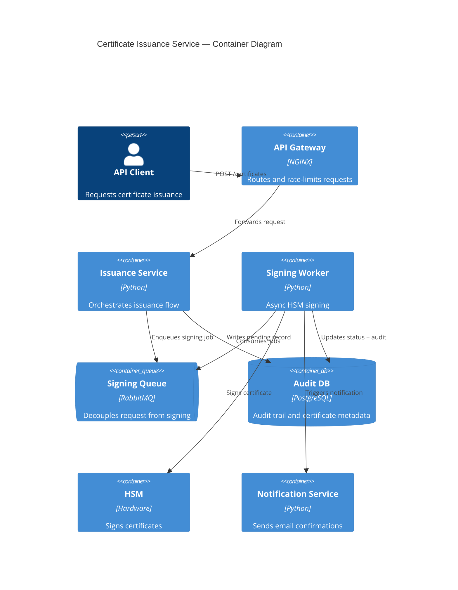

# Skill: Architecture Analysis

How to analyze a system's architecture, evaluate trade-offs, and produce actionable recommendations.

## Purpose

Analyze the architecture of a system or component to identify risks, evaluate trade-offs,
and recommend improvements backed by evidence from the codebase.

Use when: evaluating a new design proposal, reviewing an existing system for tech debt,
preparing for a major refactor, or making a build-vs-buy decision.
Do not use when: the question is about code style or a single function — use `refactor-function` instead.

## Inputs

- **Scope**: what system or component to analyze (service name, module, or repo area)
- **Question**: what architectural concern to address (scalability, coupling, complexity, security, cost)
- **Context**: known constraints (team size, SLAs, compliance requirements, timeline)
- **Existing documentation**: ADRs, C4 diagrams, or design docs if available

## Steps

### 1. Map the current architecture

- Read the codebase entry points and dependency graph
- Identify the main components: services, databases, queues, external APIs
- Map data flows: how does a request travel from entry to response?
- Document communication patterns: sync (HTTP/gRPC) vs async (events/queues)

### 2. Identify architectural characteristics

For each component, assess:
- **Coupling**: how many other components does it depend on? Are dependencies explicit?
- **Cohesion**: does the component have a single clear responsibility?
- **Scalability**: can it scale independently? What is the bottleneck?
- **Resilience**: what happens when a dependency fails? Is there a fallback?
- **Observability**: are there logs, metrics, and traces for key operations?

### 3. Evaluate trade-offs

For each identified concern:
- State the trade-off explicitly (e.g., "consistency vs availability")
- List the options with pros and cons
- Recommend one option with justification tied to the project constraints
- Flag irreversible decisions that need stakeholder alignment

### 4. Produce a C4 Context or Container diagram (text-based)

Using Mermaid syntax, produce the relevant diagram level:
- **Context**: if analyzing the system boundary and external actors
- **Container**: if analyzing internal services and their communication
- Keep it simple — max 10 nodes per diagram

### 5. Write recommendations

For each recommendation:
- State what to change and why
- Estimate effort: small (hours), medium (days), large (weeks)
- Flag dependencies on other teams or systems
- Prioritize: must-do (risk) vs should-do (improvement) vs could-do (optimization)

## Output Format

```markdown
## Architecture Analysis: [system/component name]

### Scope
[What was analyzed and why]

### Current Architecture
[Text description + Mermaid diagram]

### Key Findings

| # | Finding | Severity | Component |
|---|---------|----------|-----------|
| 1 | [finding] | [high/medium/low] | [component] |

### Trade-off Analysis

**[Decision point]**
- Option A: [description] — Pros: [...] Cons: [...]
- Option B: [description] — Pros: [...] Cons: [...]
- **Recommendation**: [option] because [justification tied to constraints]

### Recommendations

| # | Recommendation | Effort | Priority | Dependencies |
|---|---------------|--------|----------|-------------|
| 1 | [what to change] | [S/M/L] | [must/should/could] | [teams/systems] |

### Diagram

```mermaid
[C4 Context or Container diagram]
```
```

## Example Usage

**Input provided**:
- Scope: `certificate-issuance-service` — the service that issues digital certificates
- Question: the service is hitting response time SLAs during peak hours
- Context: 3-person backend team, P99 latency SLA of 2s, compliance requires audit trail
- Existing docs: ADR-003 (chose PostgreSQL for audit), no C4 diagrams

**Execution**:
1. Maps architecture: API gateway → certificate-issuance-service → PostgreSQL (audit) + HSM (signing) + notification-service (email)
2. Identifies: HSM calls are synchronous and take 800ms average; DB writes to audit table are in the same transaction as the response; no caching layer
3. Trade-off: "sync HSM signing in request path" vs "async signing with status polling"
   - Sync: simpler, but P99 spikes to 3.5s under load
   - Async: requires status endpoint and polling, but decouples latency from HSM
   - Recommends async: compliance audit can be written async too, HSM is the bottleneck
4. Produces C4 Container diagram with 5 nodes
5. Writes 3 recommendations: (1) async HSM signing [L, must-do], (2) separate audit writes to async worker [M, should-do], (3) add Redis cache for certificate status lookups [S, could-do]

**Output**:
```markdown
## Architecture Analysis: certificate-issuance-service

### Scope
Performance analysis of the certificate issuance flow during peak hours.
The service is breaching its 2s P99 latency SLA.

### Current Architecture
The service receives issuance requests via API gateway, performs synchronous
HSM signing (avg 800ms), writes an audit record to PostgreSQL in the same
transaction, and triggers a notification via HTTP call to notification-service.

### Key Findings

| # | Finding | Severity | Component |
|---|---------|----------|-----------|
| 1 | HSM signing is synchronous in request path (800ms avg) | High | certificate-issuance-service |
| 2 | Audit write in same DB transaction as response | Medium | PostgreSQL |
| 3 | No caching for certificate status lookups | Low | certificate-issuance-service |

### Trade-off Analysis

**HSM signing: synchronous vs asynchronous**
- Option A: Keep sync — Pros: simple flow, immediate response. Cons: P99 = 3.5s under load, breaches SLA
- Option B: Async with status polling — Pros: decouples latency, HSM can batch. Cons: client needs polling, adds complexity
- **Recommendation**: Option B — the 2s SLA is non-negotiable, and HSM latency is the primary bottleneck. The team can use a simple queue + status endpoint pattern.

### Recommendations

| # | Recommendation | Effort | Priority | Dependencies |
|---|---------------|--------|----------|-------------|
| 1 | Move HSM signing to async worker with status polling | L (2 weeks) | Must-do | None |
| 2 | Separate audit writes to async consumer | M (3 days) | Should-do | Compliance team sign-off |
| 3 | Add Redis cache for certificate status | S (4 hours) | Could-do | Infra team for Redis provisioning |

### Diagram


```
