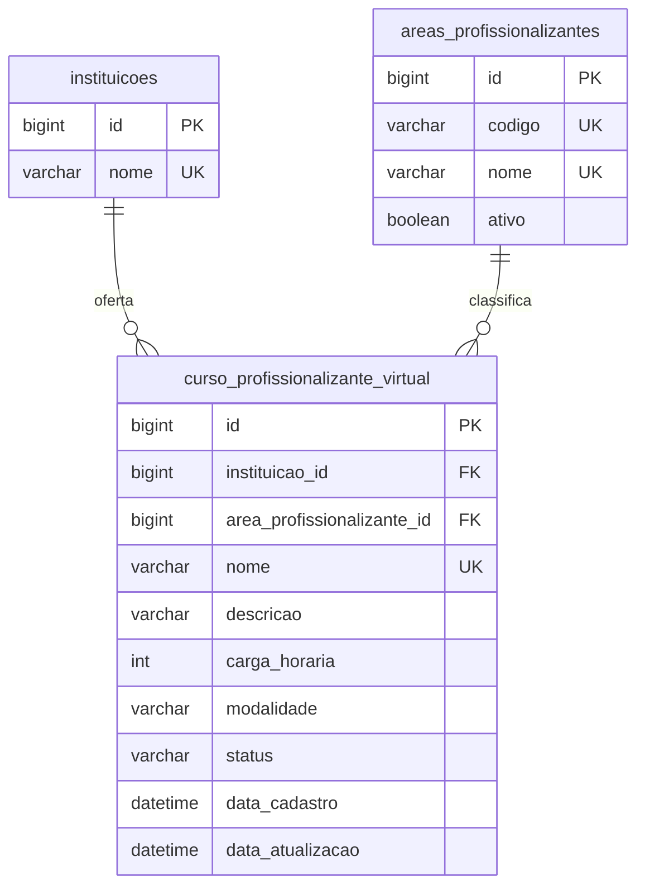
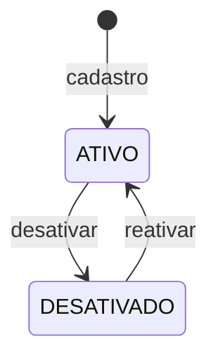

# Data Model: Cursos Profissionalizantes Virtuais

**Feature**: `001-cursos-profissionalizantes-virtuais`  
**Date**: 2026-06-26  
**Estratégia física**: A — tabela dedicada (ver [research.md](./research.md#r1--estratégia-de-modelo-físico-a-vs-b))

## Visão geral



## Entidades JPA

### `AreaProfissionalizante`

| Coluna | Tipo SQLite/JPA | Constraints | Notas |
|--------|-----------------|-------------|-------|
| `id` | `BIGINT` PK AUTO | NOT NULL | Surrogate |
| `codigo` | `VARCHAR(20)` | NOT NULL, UNIQUE | Estável (ex.: `TEC`) |
| `nome` | `VARCHAR(100)` | NOT NULL, UNIQUE | Ex.: "Tecnologia" |
| `ativo` | `BOOLEAN` | NOT NULL, default `true` | Inativas bloqueiam novo vínculo |

**Tabela**: `areas_profissionalizantes`  
**Classe**: `com.faculdade.media.domain.AreaProfissionalizante`  
**Operações v1**: somente leitura via API; seed na startup (FR-012).

### `CursoProfissionalizanteVirtual`

| Coluna | Tipo SQLite/JPA | Constraints | Notas |
|--------|-----------------|-------------|-------|
| `id` | `BIGINT` PK AUTO | NOT NULL | |
| `instituicao_id` | `BIGINT` FK | NOT NULL | → `instituicoes.id` |
| `area_profissionalizante_id` | `BIGINT` FK | NOT NULL | → `areas_profissionalizantes.id` |
| `nome` | `VARCHAR(100)` | NOT NULL, UNIQUE (escopo CPV) | Trim no service |
| `descricao` | `VARCHAR(2000)` | NULL | Opcional |
| `carga_horaria` | `INTEGER` | NOT NULL, CHECK 1–9999 | Horas |
| `modalidade` | `VARCHAR` enum STRING | NOT NULL, fixo `VIRTUAL` | Imutável (FR-008) |
| `status` | `VARCHAR` enum STRING | NOT NULL, default `ATIVO` | `ATIVO` \| `DESATIVADO` |
| `data_cadastro` | `TIMESTAMP` | NOT NULL | `@PrePersist` |
| `data_atualizacao` | `TIMESTAMP` | NOT NULL | `@PreUpdate` |

**Tabela**: `curso_profissionalizante_virtual`  
**Classe**: `com.faculdade.media.domain.CursoProfissionalizanteVirtual`  
**Relações**: `@ManyToOne` com `Instituicao` e `AreaProfissionalizante` (padrão `Disciplina`).

### Enums de domínio

```java
public enum ModalidadeEnsino { VIRTUAL }

public enum StatusOferta { ATIVO, DESATIVADO }
```

Persistência: `@Enumerated(EnumType.STRING)`.

## Atributos derivados (API, não persistidos)

| Atributo | Valor | Origem |
|----------|-------|--------|
| `tipoCurso` | `"PROFISSIONALIZANTE"` | Constante no `CursoProfissionalizanteVirtualDTO` (FR-009) |
| `instituicaoNome` | string | JOIN/desnormalização no service |
| `areaProfissionalizanteNome` | string | JOIN/desnormalização no service |
| `ofertaAtiva` | boolean | `status == ATIVO` |

## Regras de integridade

| ID | Regra | Implementação |
|----|-------|---------------|
| IL-01 | UK `nome` em CPV | `@UniqueConstraint` + `existsByNome` no repository |
| IL-02 | `carga_horaria` ∈ [1, 9999] | Bean Validation + service |
| IL-03 | `modalidade` imutável | Service rejeita alteração em `atualizar` |
| IL-04 | `instituicao_id` existe | `InstituicaoRepository.findById` → 404 |
| IL-05 | área existe e ativa | `AreaProfissionalizanteRepository` → 400 se inativa |
| IL-06 | `DESATIVADO` ↔ `ATIVO` | `desativar()` / `reativar()` no service |
| IL-07 | Distinção do `Curso` legado | Entidade/tabela separada + `tipoCurso` na resposta |

## Queries do repository

| Método | Uso |
|--------|-----|
| `save` | persist/merge |
| `findById` | consulta por id (ativo ou desativado) |
| `findAllAtivos` | listagem padrão (`status = ATIVO`, ORDER BY nome) |
| `existsByNome` | unicidade no cadastro |
| `existsByNomeExcluindoId` | reservado para futura edição de nome |
| `findAtivaById` | validação IL-05 |

### `AreaProfissionalizanteRepository`

| Método | Uso |
|--------|-----|
| `findAllAtivas` | GET catálogo (FR-012) |
| `findById` | detalhe opcional |
| `findAtivaById` | validação no cadastro/edição CPV |
| `existsByCodigo` | seed idempotente |

## Transições de estado (`StatusOferta`)



Sem exclusão física na v1 (FR-007).

## Campos editáveis vs imutáveis

| Campo | Criação | Atualização |
|-------|---------|-------------|
| `instituicao_id` | Obrigatório | Imutável |
| `nome` | Obrigatório | Imutável (R4) |
| `area_profissionalizante_id` | Obrigatório | Editável |
| `descricao` | Opcional | Editável |
| `carga_horaria` | Obrigatório | Editável |
| `modalidade` | Fixo `VIRTUAL` | Imutável |
| `status` | Default `ATIVO` | Via PATCH desativar/reativar |

## Registros de persistência

Adicionar em `src/main/resources/META-INF/persistence.xml` e `src/test/resources/META-INF/persistence.xml`:

```xml
<class>com.faculdade.media.domain.AreaProfissionalizante</class>
<class>com.faculdade.media.domain.CursoProfissionalizanteVirtual</class>
```

Schema evolutivo via `hibernate.hbm2ddl.auto=update` (main) / `create-drop` (test).

## Rastreabilidade spec → modelo

| Requisito | Elemento |
|-----------|----------|
| FR-001 | Entidade CPV, modalidade VIRTUAL |
| FR-002 | FKs + campos obrigatórios |
| FR-003 | UK nome na tabela CPV |
| FR-005 | `findAllAtivos` vs `findById` |
| FR-006 | DTO de atualização parcial |
| FR-007 | status DESATIVADO, sem DELETE |
| FR-008 | modalidade imutável |
| FR-009 | tipoCurso derivado |
| FR-012 | AreaProfissionalizante seed read-only |
