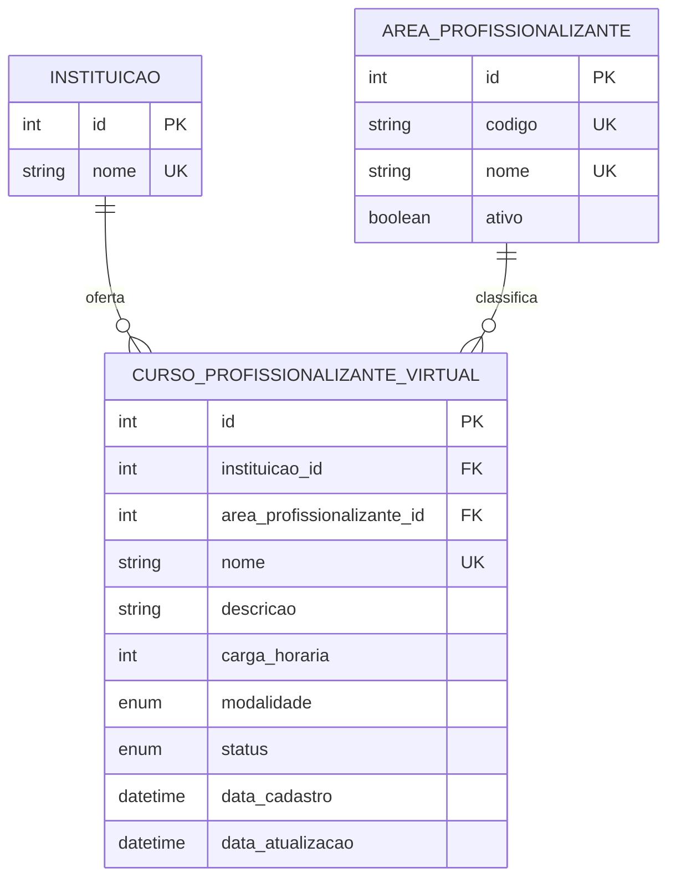
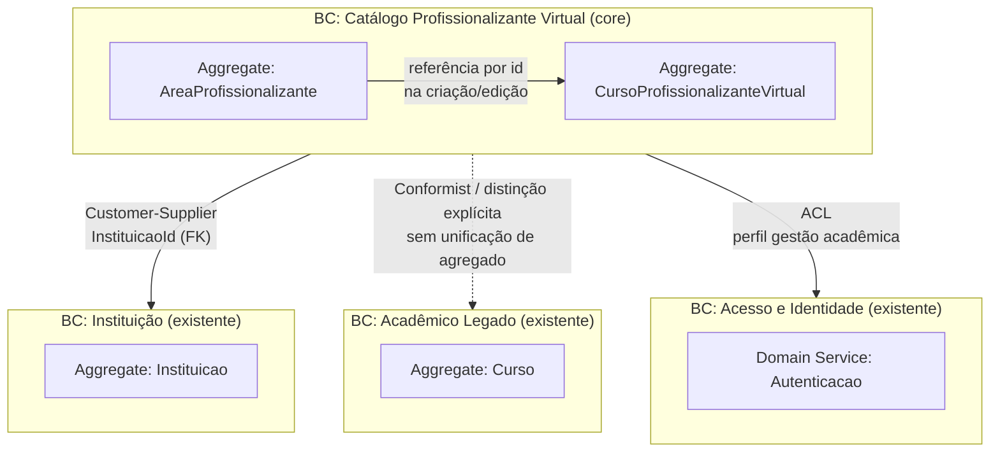
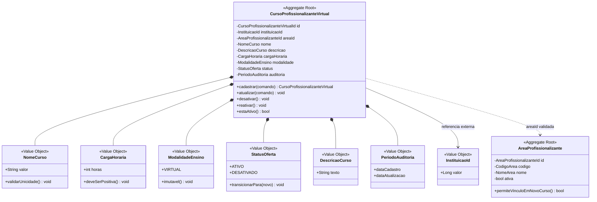
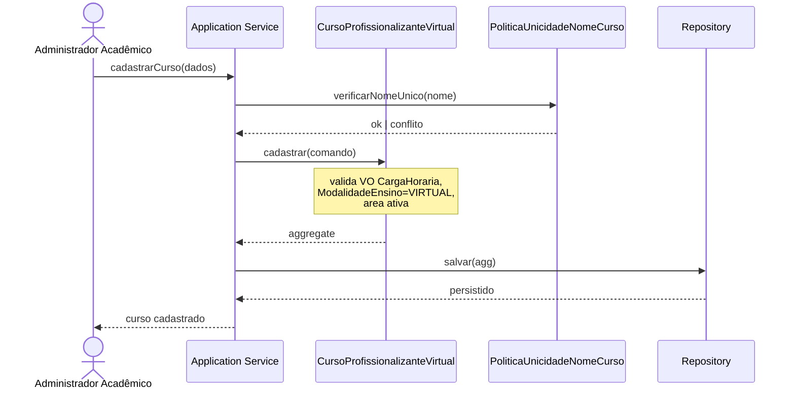

# Feature Specification: Cadastro de Cursos Profissionalizantes Virtuais

**Feature Branch**: `001-cursos-profissionalizantes-virtuais`

**Created**: 2026-06-26

**Status**: Draft

**Input**: User description: "criar cadastro de cursos profissionalizantes virtuais, isto é remoto"

## Clarifications

### Session 2026-06-26

- Q: Como determinar a instituição no cadastro de curso profissionalizante virtual? → A: Administrador seleciona explicitamente a instituição no cadastro (`instituicao_id` obrigatório no input).
- Q: Como gerenciar o catálogo de áreas profissionalizantes na v1? → A: Catálogo pré-populado (seed) somente leitura — administrador apenas seleciona área existente; sem CRUD de áreas nesta feature.
- Q: Quem pode acessar os endpoints de cursos profissionalizantes virtuais na v1? → A: Somente administrador autenticado — todas as operações (cadastro, edição, desativação e consulta).
- Q: Qual o comportamento padrão da listagem de cursos profissionalizantes virtuais? → A: Listagem padrão retorna somente cursos `ATIVO`; desativados acessíveis apenas por identificador.
- Q: A unicidade do nome se aplica também ao catálogo legado `Curso`? → A: Unicidade apenas dentro de CPV — colisão com nome de `Curso` legado é permitida; distinção via `tipo_curso`.

## User Scenarios & Testing *(mandatory)*

### User Story 1 - Cadastrar curso profissionalizante virtual (Priority: P1)

Como administrador acadêmico, quero cadastrar um novo curso profissionalizante
oferecido exclusivamente na modalidade virtual (remota), para que a instituição
possa divulgar e gerir formações profissionalizantes a distância.

**Why this priority**: Sem o cadastro, nenhum curso profissionalizante remoto
pode existir no catálogo — é o núcleo de valor da feature.

**Independent Test**: Pode ser testado cadastrando um curso com dados mínimos
obrigatórios e verificando que ele aparece no catálogo identificado como
profissionalizante e virtual.

**Acceptance Scenarios**:

1. **Given** um administrador autenticado com permissão de gestão acadêmica e ao
   menos uma instituição cadastrada, **When** seleciona a instituição ofertante,
   preenche nome, seleciona área profissionalizante do catálogo pré-populado, carga
   horária, descrição e confirma modalidade virtual, **Then** o curso é registrado
   com sucesso vinculado à instituição escolhida e fica disponível para consulta.
2. **Given** um administrador autenticado, **When** tenta cadastrar um curso sem
   informar campos obrigatórios (instituição, nome, área, carga horária ou
   modalidade virtual), **Then** o sistema impede o cadastro e informa claramente
   quais campos precisam ser corrigidos.
3. **Given** um curso profissionalizante virtual já cadastrado com o mesmo nome,
   **When** o administrador tenta cadastrar outro curso com nome idêntico,
   **Then** o sistema rejeita o cadastro e informa que o nome já está em uso.
4. **Given** um curso acadêmico legado cadastrado com determinado nome,
   **When** o administrador cadastra um curso profissionalizante virtual com o
   mesmo nome, **Then** o cadastro é aceito e o curso é identificado como
   profissionalizante virtual (`tipo_curso`), distinguível do curso legado.

---

### User Story 2 - Consultar cursos profissionalizantes virtuais (Priority: P2)

Como administrador acadêmico, quero consultar a lista de cursos profissionalizantes
virtuais cadastrados, para acompanhar o catálogo de ofertas remotas da instituição.

**Why this priority**: Após o cadastro, a consulta é essencial para operação
diária, auditoria e divulgação interna.

**Independent Test**: Pode ser testado listando cursos após cadastrar pelo menos
um registro e verificando que apenas cursos profissionalizantes virtuais
aparecem, com seus dados principais visíveis.

**Acceptance Scenarios**:

1. **Given** cursos profissionalizantes virtuais ativos e desativados cadastrados,
   **When** um administrador autenticado solicita a listagem padrão, **Then**
   recebe somente cursos com status `ATIVO`, com nome, área, carga horária,
   modalidade virtual e status.
2. **Given** um identificador de curso profissionalizante virtual existente
   (ativo ou desativado), **When** um administrador autenticado consulta os
   detalhes desse curso, **Then** visualiza todas as informações cadastradas,
   incluindo descrição, status e indicação explícita de que a modalidade é remota.
3. **Given** nenhum curso profissionalizante virtual ativo cadastrado,
   **When** um administrador autenticado solicita a listagem padrão,
   **Then** recebe uma lista vazia sem erro.

---

### User Story 3 - Atualizar e desativar curso profissionalizante virtual (Priority: P3)

Como administrador acadêmico, quero editar informações de um curso
profissionalizante virtual ou desativá-lo quando não for mais ofertado, para
manter o catálogo atualizado sem perder histórico.

**Why this priority**: Mantém a qualidade dos dados ao longo do tempo; depende
do cadastro (P1) mas agrega valor operacional significativo.

**Independent Test**: Pode ser testado editando a descrição ou carga horária de um
curso existente e verificando a persistência; em seguida, desativando o curso e
confirmando que não aparece em listagens de ofertas ativas.

**Acceptance Scenarios**:

1. **Given** um curso profissionalizante virtual ativo, **When** o administrador
   altera campos editáveis (descrição, carga horária, área), **Then** as
   alterações são salvas e refletidas na consulta.
2. **Given** um curso profissionalizante virtual ativo, **When** o administrador
   desativa o curso, **Then** ele deixa de aparecer como oferta ativa, mas
   permanece consultável para fins de histórico por identificador.
3. **Given** um curso profissionalizante virtual, **When** o administrador tenta
   alterar a modalidade para presencial ou híbrida, **Then** o sistema rejeita a
   alteração, pois esta feature trata exclusivamente de cursos remotos.
4. **Given** um curso profissionalizante virtual previamente desativado,
   **When** o administrador solicita reativação, **Then** o curso volta ao status
   `ATIVO` e passa a aparecer novamente na listagem padrão de ofertas ativas.

---

### Edge Cases

- O que acontece quando a carga horária informada é zero ou negativa?
  → Sistema rejeita com HTTP 400 e mensagem específica sobre carga horária (FR-004).
- Como o sistema trata nomes com apenas espaços em branco ou caracteres especiais?
  → Aplica `trim()` antes de validar; nome vazio após trim é rejeitado (400).
  Caracteres especiais e acentuação UTF-8 são **permitidos** (ex.: "Técnico em Redes — 100%").
- O que ocorre se um usuário não autenticado tenta cadastrar ou consultar cursos?
  → Sistema rejeita com resposta de não autenticado (401), sem expor dados.
- Como o sistema se comporta ao consultar um curso por identificador inexistente?
  → HTTP 404 com `ErroDTO` (`codigo`: `NAO_ENCONTRADO`).
- O que acontece ao tentar reativar um curso previamente desativado?
  → PATCH `/reativar` restaura status `ATIVO`; curso retorna à listagem padrão (IL-06).
- Como garantir que cursos presenciais ou híbridos existentes no catálogo geral
  não sejam confundidos com cursos profissionalizantes virtuais desta feature?
  → Entidade separada e atributo derivado `tipo_curso = PROFISSIONALIZANTE` em
  consultas; colisão de nome com `Curso` legado é permitida (FR-003, FR-009).
- O que ocorre quando o administrador informa um `instituicao_id` inexistente ou
  inválido no cadastro?

## Requirements *(mandatory)*

### Functional Requirements

- **FR-001**: O sistema MUST permitir que administradores autenticados cadastrem
  cursos profissionalizantes com modalidade exclusivamente virtual (remota).
- **FR-002**: O sistema MUST exigir, no mínimo, instituição ofertante
  (`instituicao_id` válido e existente), nome, área profissionalizante, carga
  horária e confirmação de modalidade virtual para concluir um cadastro.
- **FR-003**: O sistema MUST garantir unicidade do nome entre cursos
  profissionalizantes virtuais cadastrados; colisão com nomes do catálogo legado
  `Curso` é permitida — distinção MUST ocorrer via `tipo_curso` (FR-009).
- **FR-004**: O sistema MUST validar que a carga horária seja um valor positivo.
- **FR-005**: O sistema MUST permitir que administradores autenticados consultem
  cursos profissionalizantes virtuais em lista e por identificador; a listagem
  padrão MUST retornar somente cursos com status `ATIVO`, enquanto a consulta por
  identificador MUST incluir cursos desativados para fins de histórico.
- **FR-006**: O sistema MUST permitir atualização de informações editáveis
  (descrição, área profissionalizante, carga horária) de cursos existentes.
- **FR-007**: O sistema MUST permitir desativar um curso profissionalizante
  virtual sem excluir permanentemente o registro.
- **FR-008**: O sistema MUST impedir alteração da modalidade de virtual para
  presencial ou híbrica após o cadastro.
- **FR-009**: O sistema MUST distinguir cursos profissionalizantes virtuais de
  outros tipos de curso no catálogo institucional, inclusive quando compartilham
  o mesmo nome com um `Curso` legado, via identificação explícita de
  `tipo_curso = PROFISSIONALIZANTE`.
- **FR-010**: O sistema MUST retornar mensagens de erro claras e acionáveis quando
  validações de cadastro ou atualização falharem.
- **FR-011**: O sistema MUST restringir todas as operações desta feature (cadastro,
  edição, desativação e consulta) a administradores autenticados na v1; acesso da
  secretaria ou outros perfis é escopo futuro.
- **FR-012**: O sistema MUST disponibilizar o catálogo de áreas profissionalizantes
  como lista fechada pré-populada (seed), somente leitura na v1; administrador MUST
  selecionar área existente e ativa — CRUD de áreas fica fora do escopo desta feature.

### Key Entities

- **Curso Profissionalizante Virtual**: Formação de caráter profissionalizante
  oferecida integralmente a distância; atributos principais: instituição
  ofertante (selecionada explicitamente no cadastro), nome (único entre CPV),
  descrição, área profissionalizante, carga horária, modalidade virtual (fixa),
  status (ativo/desativado).
- **Área Profissionalizante**: Classificação da formação (ex.: tecnologia,
  saúde, gestão, serviços) usada para organização e filtros do catálogo; na v1
  é catálogo pré-populado (seed), somente consulta — sem cadastro ou edição de
  áreas nesta feature.
- **Administrador Acadêmico**: Usuário autenticado responsável por criar, editar,
  desativar e consultar cursos profissionalizantes virtuais na v1.

## Modelo Lógico de Dados

Modelo lógico para validação de negócio antes da implementação do modelo físico.
Tipos indicados são **domínios lógicos** (não tipos de banco ou linguagem).

### Objetivo e escopo

Representar as informações necessárias para cadastrar, consultar, atualizar e
desativar cursos profissionalizantes virtuais, garantindo distinção em relação ao
catálogo genérico de cursos já existente no sistema acadêmico.

**Entidades existentes referenciadas** (fora do escopo de alteração nesta spec,
salvo vínculo):

| Entidade lógica | Papel no contexto |
|-----------------|-------------------|
| INSTITUIÇÃO | Organização que oferta o curso profissionalizante virtual |
| CURSO (legado) | Catálogo acadêmico genérico (nome); MUST permanecer distinguível |

### Diagrama entidade-relacionamento

### Entidades lógicas

#### AREA_PROFISSIONALIZANTE

Catálogo de referência (lista fechada) para classificação das formações. Na v1,
dados pré-populados via seed; administrador apenas consulta e seleciona — sem CRUD
de áreas nesta feature.

| Atributo | Domínio lógico | Obrig. | Regra de negócio |
|----------|----------------|--------|------------------|
| id | Identificador | Sim | PK, surrogate |
| codigo | Código alfanumérico (≤ 20) | Sim | UK; estável para integração |
| nome | Texto (≤ 100) | Sim | UK; ex.: "Tecnologia", "Saúde" |
| ativo | Booleano | Sim | Default verdadeiro; inativos não aparecem em novos cadastros |

#### CURSO_PROFISSIONALIZANTE_VIRTUAL

Oferta de formação profissionalizante exclusivamente remota.

| Atributo | Domínio lógico | Obrig. | Regra de negócio |
|----------|----------------|--------|------------------|
| id | Identificador | Sim | PK, surrogate |
| instituicao_id | Identificador | Sim | FK → INSTITUIÇÃO; curso pertence a uma instituição |
| area_profissionalizante_id | Identificador | Sim | FK → AREA_PROFISSIONALIZANTE; área MUST estar ativa no cadastro |
| nome | Texto (≤ 100) | Sim | UK global nesta entidade (não cruza com `Curso` legado); trim; não vazio |
| descricao | Texto longo (≤ 2000) | Não | Editável após cadastro |
| carga_horaria | Inteiro positivo | Sim | > 0; unidade: horas |
| modalidade | Enum | Sim | Fixo `VIRTUAL` na criação; imutável (FR-008) |
| status | Enum | Sim | `ATIVO` \| `DESATIVADO`; default `ATIVO` |
| data_cadastro | Data/hora | Sim | Preenchida na inclusão |
| data_atualizacao | Data/hora | Sim | Atualizada a cada alteração |

**Atributos derivados (consulta, não persistidos como regra de negócio):**

| Atributo derivado | Derivação |
|-------------------|-----------|
| tipo_curso | Constante lógica `PROFISSIONALIZANTE` — distingue de CURSO legado (FR-009) |
| oferta_ativa | `status = ATIVO` — listagem padrão filtra por este critério (FR-005, SC-005) |

### Domínios lógicos (valores permitidos)

| Domínio | Valores | Observação |
|---------|---------|------------|
| modalidade | `VIRTUAL` | Único valor permitido nesta feature; remoto 100% |
| status | `ATIVO`, `DESATIVADO` | Desativado preserva histórico (FR-007) |
| carga_horaria | Inteiro ∈ [1, 9999] | Limite superior sugerido para validação de negócio |

### Relacionamentos e cardinalidades

| Relacionamento | Cardinalidade | Participação | Regra |
|----------------|---------------|--------------|-------|
| INSTITUIÇÃO oferta CURSO_PROFISSIONALIZANTE_VIRTUAL | 1 : N | Instituição parcial; curso total | Todo curso prof. virtual MUST ter instituição |
| AREA_PROFISSIONALIZANTE classifica CURSO_PROFISSIONALIZANTE_VIRTUAL | 1 : N | Área parcial; curso total | Uma área por curso; área inativa bloqueia novo vínculo |

### Restrições de integridade lógica

| ID | Tipo | Descrição | Origem |
|----|------|-----------|--------|
| IL-01 | Unicidade | `nome` único em CURSO_PROFISSIONALIZANTE_VIRTUAL (escopo CPV; colisão com `Curso` legado permitida) | FR-003 |
| IL-02 | Domínio | `carga_horaria` > 0 | FR-004 |
| IL-03 | Imutabilidade | `modalidade` não alterável após insert | FR-008 |
| IL-04 | Referencial | `instituicao_id` MUST existir em INSTITUIÇÃO | Assumption |
| IL-05 | Referencial | `area_profissionalizante_id` MUST existir e área MUST estar ativa | FR-002 |
| IL-06 | Estado | transição `DESATIVADO` → `ATIVO` permitida (reativação); inverso permitido | Edge case |
| IL-07 | Distinção | registros desta entidade MUST NOT ser confundidos com CURSO legado; distinção via entidade/`tipo_curso`, não via bloqueio global de nome | FR-009 |

### Rastreabilidade requisitos → modelo lógico

| Requisito | Elemento lógico |
|-----------|-----------------|
| FR-001 | Entidade CURSO_PROFISSIONALIZANTE_VIRTUAL; modalidade = VIRTUAL |
| FR-002 | Atributos obrigatórios: instituicao_id, nome, area_profissionalizante_id, carga_horaria, modalidade |
| FR-012 | Entidade AREA_PROFISSIONALIZANTE seed somente leitura; seleção de área ativa |
| FR-003 | UK(nome) em CURSO_PROFISSIONALIZANTE_VIRTUAL; sem unicidade cruzada com Curso legado |
| FR-005 | Listagem padrão filtra `status = ATIVO`; consulta por id inclui desativados |
| FR-006 | Atributos editáveis: descricao, area_profissionalizante_id, carga_horaria |
| FR-007 | Atributo status = DESATIVADO (soft lifecycle) |
| FR-009 | Entidade própria + tipo_curso derivado PROFISSIONALIZANTE (distinção mesmo com nome igual) |

### Decisão para modelo físico (construção)

Duas estratégias válidas; escolha na fase de plano/implementação:

| Estratégia | Descrição | Prós | Contras |
|------------|-----------|------|---------|
| **A — Entidade dedicada** | Tabela `curso_profissionalizante_virtual` separada de `cursos` | Isolamento; não impacta legado | Possível duplicidade semântica de "curso" |
| **B — Generalização de CURSO** | Estender `cursos` com `tipo`, `modalidade`, atributos profissionalizantes | Catálogo unificado | Migração e impacto em disciplinas/matriculas |

**Recomendação lógica**: Estratégia **A** para esta feature, pois matrículas e
disciplinas do legado ficam fora de escopo (Assumptions). Vínculo com INSTITUIÇÃO
via FK explícita. O modelo físico MUST materializar este diagrama sem contradizer
as regras IL-01 a IL-07.

## Diagrama de Domínio (DDD)

Visão de **Domain-Driven Design** para complementar o modelo lógico: foco em
contextos delimitados, agregados, objetos de valor e linguagem ubíqua. Não
prescreve camada de infraestrutura ou persistência.

### Linguagem ubíqua

| Termo | Significado no domínio |
|-------|------------------------|
| Curso profissionalizante virtual | Oferta formativa de natureza profissionalizante, 100% remota |
| Área profissionalizante | Classificação temática estável da formação (catálogo de referência) |
| Modalidade virtual | Invariante de negócio: ensino exclusivamente a distância |
| Oferta ativa | Curso com status que permite divulgação operacional no catálogo |
| Catálogo | Conjunto governado de cursos profissionalizantes virtuais da instituição |
| Desativação | Retirada da oferta ativa sem exclusão do histórico |

### Mapa de contextos

| Contexto | Responsabilidade | Relação com CPV |
|----------|------------------|-----------------|
| **Catálogo Profissionalizante Virtual** | CRUD de ofertas profissionalizantes remotas | Core desta feature |
| **Instituição** | Dados cadastrais da organização ofertante | Fornecedor upstream (id válido) |
| **Acadêmico Legado** | Cursos, disciplinas, matrículas | Contexto separado; sem merge de agregados |
| **Acesso e Identidade** | Autenticação e perfis | Política de autorização consumida via ACL |

### Agregados e limites de consistência

### Inventário DDD

| Elemento | Nome | Tipo DDD | Invariantes principais |
|--------|------|----------|------------------------|
| AR-01 | `CursoProfissionalizanteVirtual` | Aggregate Root | modalidade = VIRTUAL; nome único no BC; cargaHoraria > 0 |
| AR-02 | `AreaProfissionalizante` | Aggregate Root | código e nome únicos; só áreas ativas em novos vínculos |
| VO-01 | `NomeCurso` | Value Object | não vazio; trim; max 100 |
| VO-02 | `CargaHoraria` | Value Object | inteiro positivo |
| VO-03 | `ModalidadeEnsino` | Value Object | somente VIRTUAL; imutável após criação |
| VO-04 | `StatusOferta` | Value Object | ATIVO ↔ DESATIVADO |
| VO-05 | `InstituicaoId` | Value Object | referência a agregado externo |
| DS-01 | `PoliticaUnicidadeNomeCurso` | Domain Service | verifica unicidade antes de persistir (IL-01) |
| DS-02 | `PoliticaAreaProfissionalizanteAtiva` | Domain Service | valida área ativa no cadastro/edição (IL-05) |
| REPO-01 | `CursoProfissionalizanteVirtualRepository` | Repository (port) | persistência do agregado AR-01 |
| REPO-02 | `AreaProfissionalizanteRepository` | Repository (port) | consulta catálogo de áreas AR-02 |

### Eventos de domínio (opcionais, v1)

| Evento | Disparo | Consumidor potencial (futuro) |
|--------|---------|-------------------------------|
| `CursoProfissionalizanteVirtualCadastrado` | Após cadastro bem-sucedido | Divulgação, auditoria |
| `CursoProfissionalizanteVirtualAtualizado` | Após edição de atributos permitidos | Sincronização de catálogo externo |
| `CursoProfissionalizanteVirtualDesativado` | Após desativação | Retirada de ofertas ativas |
| `CursoProfissionalizanteVirtualReativado` | Após reativação | Restauração em listagens ativas |

### Fluxo de domínio — cadastro (P1)

### Rastreabilidade DDD ↔ modelo lógico

| DDD | Modelo lógico |
|-----|---------------|
| Aggregate `CursoProfissionalizanteVirtual` | Entidade `CURSO_PROFISSIONALIZANTE_VIRTUAL` |
| Aggregate `AreaProfissionalizante` | Entidade `AREA_PROFISSIONALIZANTE` |
| VO `InstituicaoId` | FK `instituicao_id` → `INSTITUIÇÃO` |
| VO `ModalidadeEnsino` | Atributo `modalidade` (domínio VIRTUAL) |
| VO `StatusOferta` | Atributo `status` |
| `PoliticaUnicidadeNomeCurso` | IL-01 |
| BC Acadêmico Legado (separado) | IL-07 / FR-009 |

### Notas para implementação

- **Um agregado por transação**: cadastro, edição e desativação MUST tratar
  `CursoProfissionalizanteVirtual` como unidade de consistência.
- **Referências entre agregados por id**: `InstituicaoId` e `AreaProfissionalizanteId`
  — sem navegação de objeto entre BCs na camada de domínio.
- **Anti-corruption**: DTOs de entrada/saída na camada de aplicação/API MUST NOT
  vazar regras do BC Acadêmico Legado para o agregado CPV.
- O diagrama de domínio MUST ser revisado no `/speckit-plan` junto ao `data-model.md`
  físico derivado do modelo lógico.

## Success Criteria *(mandatory)*

### Measurable Outcomes

- **SC-001**: Administradores conseguem concluir o cadastro de um curso
  profissionalizante virtual em menos de 3 minutos, em condições normais de uso.
  *(KPI operacional — validação manual via quickstart C1, sem tarefa automatizada.)*
- **SC-002**: 100% dos cursos registrados por esta feature aparecem identificados
  como profissionalizantes e com modalidade virtual nas consultas.
- **SC-003**: Pelo menos 95% das tentativas de cadastro com dados inválidos
  resultam em mensagem específica sobre o campo incorreto, sem erro genérico.
  **Proxy automatizado v1**: conjunto mínimo C2 (nome duplicado), C9 (carga
  inválida), campos obrigatórios ausentes e `instituicao_id` inexistente — todos
  MUST retornar `ErroDTO` com `codigo` e `mensagem` acionáveis (FR-010).
- **SC-004**: Administrador autenticado localiza qualquer curso profissionalizante
  virtual cadastrado em até 2 ações (listar ou buscar por identificador).
- **SC-005**: Cursos desativados deixam de constar em listagens de ofertas ativas
  em 100% dos casos verificados.

## Assumptions

- "Virtual" significa 100% remoto; cursos híbridos ou presenciais ficam fora do
  escopo desta feature.
- O sistema de autenticação existente (Basic Auth) será reutilizado na v1; somente
  administrador autenticado acessa cadastro, edição, desativação e consulta desta
  feature — perfis adicionais (ex.: secretaria) são escopo futuro.
- Áreas profissionalizantes são escolhidas exclusivamente de catálogo pré-populado
  (seed), somente leitura na v1; gestão (CRUD) de áreas é escopo futuro.
- Não há integração com plataforma de ensino (LMS) nesta versão; apenas cadastro
  e gestão do catálogo institucional.
- Vínculo com instituição específica segue o modelo organizacional já adotado
  pelo sistema acadêmico existente.
- Matrículas, turmas e conteúdo didático de cursos profissionalizantes virtuais
  são escopo futuro, não incluídos nesta feature.
